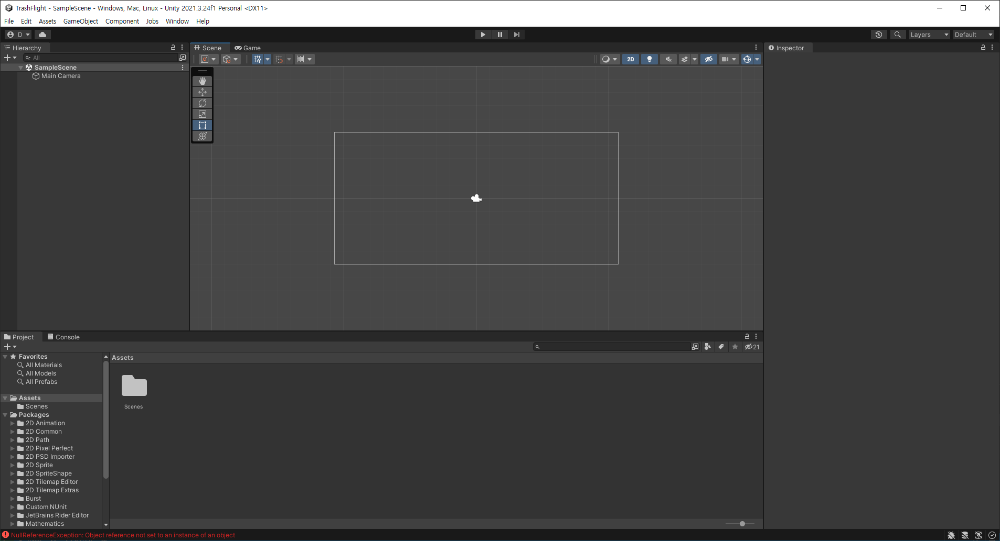
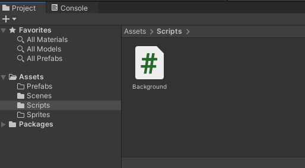
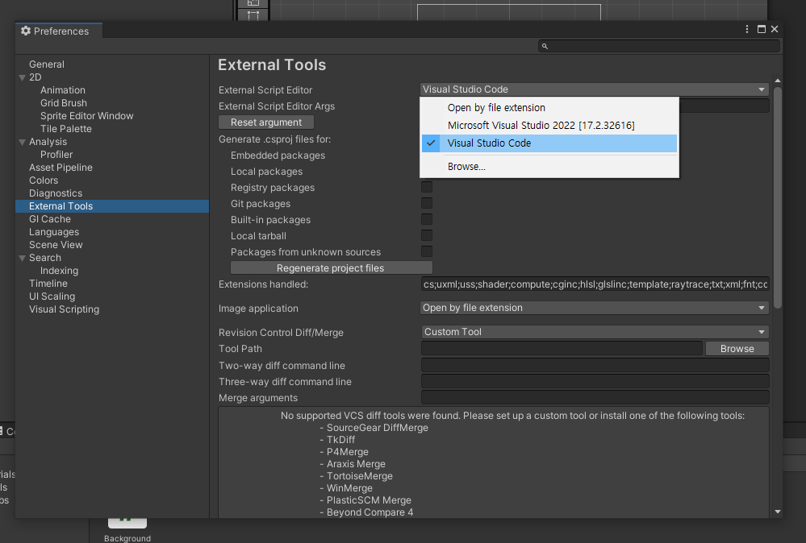
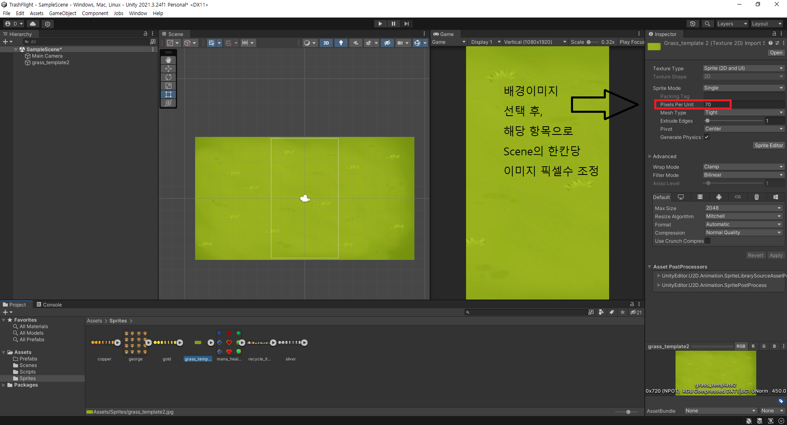
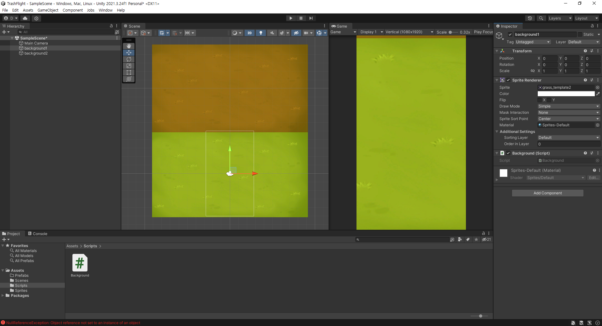
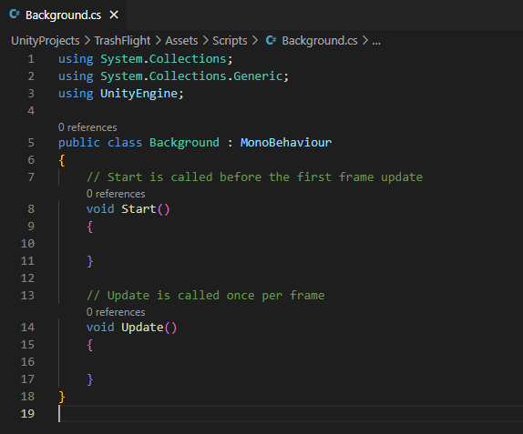

**Day1**

# 1. Unity

- 전세계적으로 유명한 게임엔진. 2d, 3d, vr 가상환경을 만들 수 있다.
- 배우기 쉽고 게임에 필요한 많은 것들이 준비되어있어 GUI 조작으로 쉽게 만들 수 있다.
- 멀티 플랫폼이 지원된다. 그래서 게임을 한 번만 개발하면 여러 기기에서 플레이가 가능하다.
- 에셋스토어가 있어 게임 개발에 필요한 리소스들을 사용할 수 있게 해준다.
- 개인 개발자들은 수익 $100k 미만(1억 3천만원 미만)이면 무료버전으로 사용가능하다.

- unity는 C#을 스크립트로 사용한다. => Java와 유사하기에 Java를 배우면 편하다.

# 2. 환경설정하기

- unity hub 다운
- visual studio code 다운 및 extension (C#(최초 프로젝트 설치시 1.24.4버전 설치함), unity tools, unity code snippets)를 설치.

# 3. 초기환경



- hierarchy : 각종 object의 모임. 게임 화면에서 여러 객체들을 볼 수 있게 해준다.
    - 오른쪽 클릭 및 object에서 새로운 object 생성가능.

- Scene view & Game view
    - 게임을 만드는 과정을 보는 곳이 Scene, 실제 게임 화면이 Game이다.
    - Scene에서 자유롭게 object를 움직이고 크기 조정 및 회전 가능.
    - Game 화면에서 해상도 조절로 이후 여러 플랫폼 개발에 유용하게 사용가능하다.

- Inspector : object나 파일의 정보를 볼 수 있는 component를 보여준다.
    - transform으로 Scene화면에서 행한 위치, 크기, 회전을 수치로 조정가능.
    - sprite renderer : object 선택시 여러 옵션을 조정할 수 있다.
    - 어떤 component를 추가하고 싶다면 해당 창의 add를 누르면 할 수 있다. :을 눌러 제거도 가능.
    - ***Rigidbody 2D*** 추가로 게임 오브젝트의 물리법칙을 적용할 수 있다.

- 게임 플레이는 화면 상단의 플레이 버튼을 누르면 된다. 누르면 게임화면 이외의 창이 색이 약간 어두워진다.

- 화면 하단의 project와 console이 있다.
    - project : 프로젝트에 필요한 파일들이 있다.
    - console : 스크립트의 문제나 출력문을 보기 위한 곳



- script를 vs code에서 진행하기 위해 Edit > Preferences 이후, 아래처럼 실행


# 4. 간단한 게임 화면 만들어보기

## 1) 게임 이미지

[오픈소스 이미지 사이트](https://opengameart.org/)

- 배경 만들기


※ 팁 : project settings에서 editor > enter play mode options를 선택하면 플레이 눌렀을 시 좀 더 빠르게 실행 가능.

## 2) 움직이는 게임 화면 만들기

- 위로 움직이는 배경을 만든다? => 배경이미지를 2개를 만들고 컨베이어 벨트처럼 하나가 움직인 후, 일정 위치에 도달하면 다시 위로 보내어 아래로 내려보낸다.
- 아래처럼 script를 배경을 선택후 inspector에 넣어주면 component로 들어가서 해당 script에 영향을 받게 된다.

- 초기에 보여지는 스크립트 파일 내용.


```C#
public class Background : MonoBehaviour
{
    // 움직이는 스피드
    // private로 다른곳에서 접근 불가. float로 자연스러운 움직임 구현.
    private float moveSpeed = 3f;

    // Update is called once per frame
    void Update()
    {
        // 배경 이미지 위로 올리기
        // Vector3 클래스는 object의 움직임을 표현한다.
        // Time.deltaTime : 플랫폼마다 컴퓨터의 성능이 다르기 때문에, 이를 맞춰주는 역할을 한다.
        transform.position += Vector3.down * moveSpeed * Time.deltaTime;
        if (transform.position.y < -10)
        {
            // 이렇게 새로운 객체를 만들어서 조절할 수도 있다.
            transform.position += new Vector3(0,20f,0);
        }
    }
}
```
