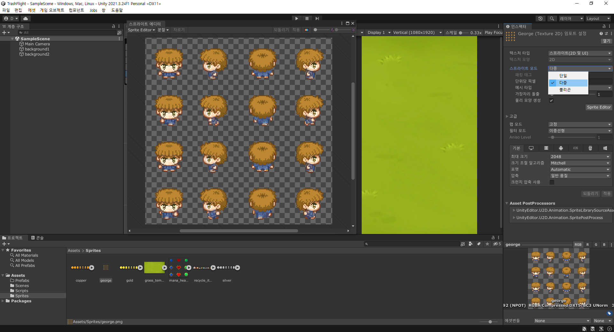
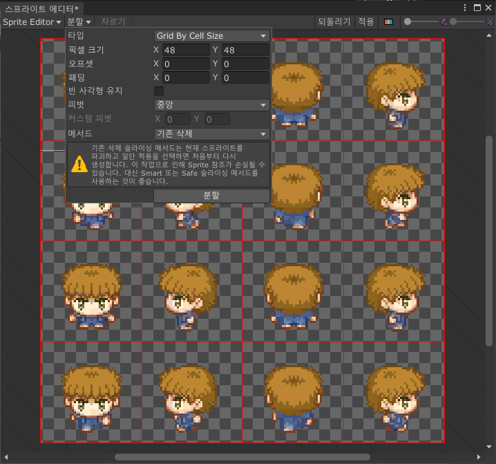
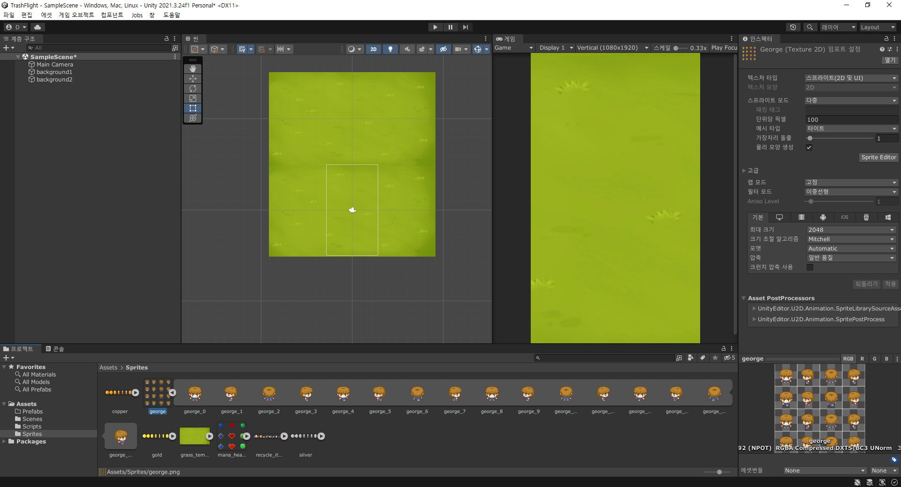
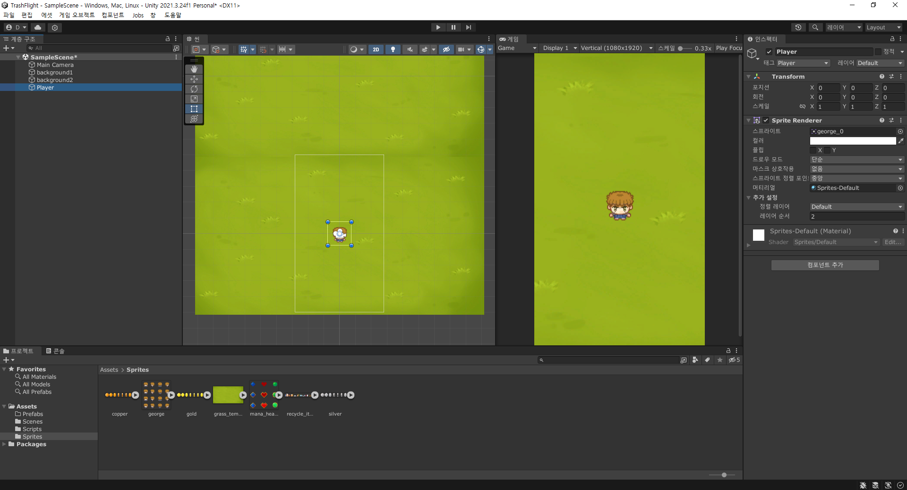
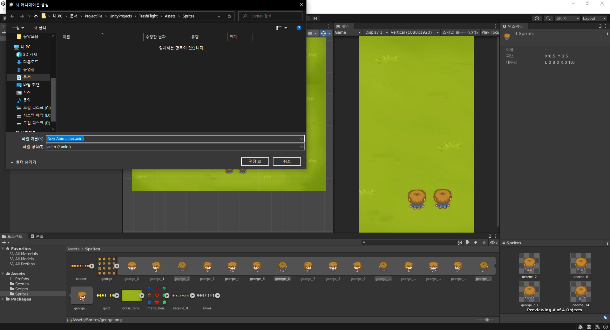
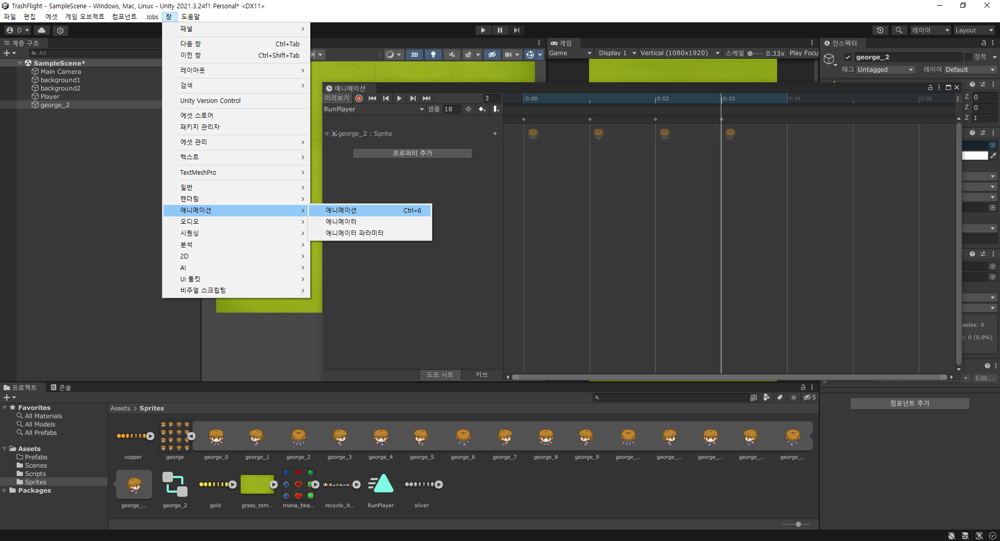
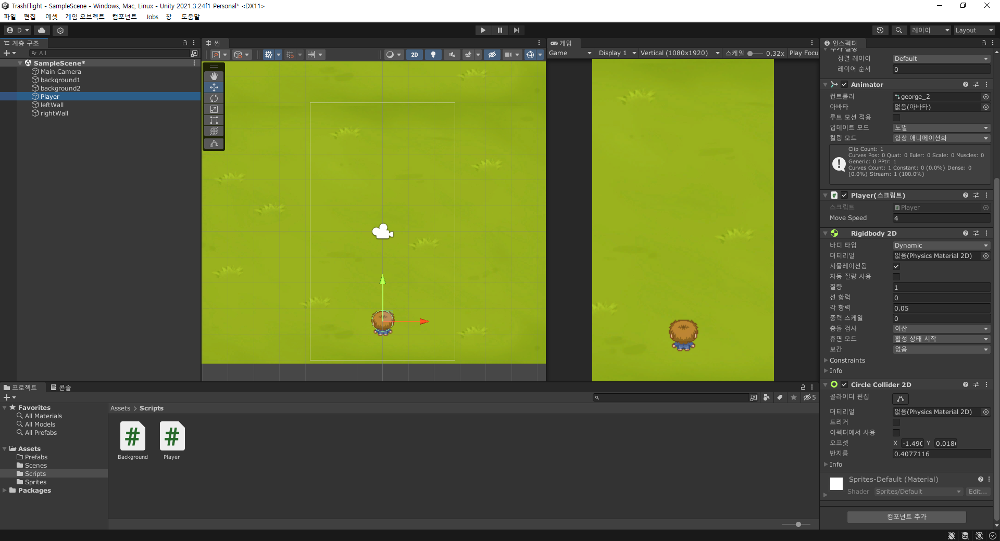
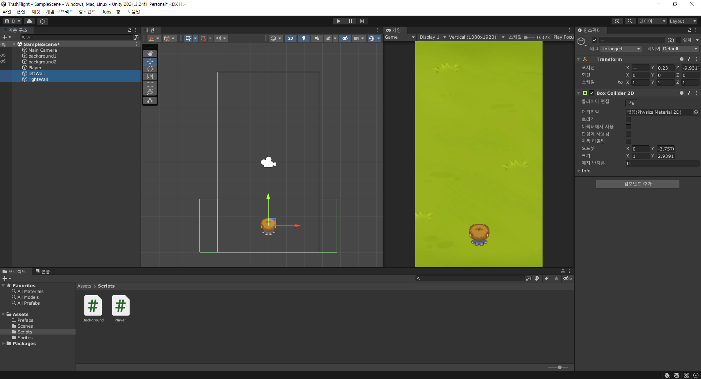

# 1. 플레이어 만들기

- 캐릭터 모델 선택 후, inspector에서 스프라이트 모드 선택 후, 멀티 선택.
- 이후 sprite Editor를 열어서 apply



- 이때, 자르는 적용 방법은 다양하게 사용 가능.
- 이후 sprites 폴더에서 기존 사진의 화살표 버튼을 클릭하여 제대로 잘렸는지 확인.


- 플레이어를 화면에 두면 완성.


- 해당 캐릭터는 플레이어이므로, 이름과 태그를 모두 player로 지정해주자.

# 2. 플레이어 애니메이션

- 애니메이션을 만들기 위해서는 파일이 하나 추가되어야 한다.
- 아래처럼 여러개의 sprite를 선택한 후, 화면에 드래그하면 저장할 수 있는 창이 나타난다.


- 새롭게 만들어진 오브젝트는 기존에 만들어두었던 오브젝트의 인스펙터와는 달리 애니메이터를 가지고 있다.
- 이는 windows의 애니메이션 창에서 해당 애니메이션의 속도와 샘플을 확인할 수 있다.


# 3. 키보드로 움직이기

```C#
public class Player : MonoBehaviour
{
    [SerializeField] // 이는 유니티에서 moveSpeed의 값을 조절할 수 있게 해준다.
    private float moveSpeed;

    // Update is called once per frame
    void Update()
    {
        // 방법 1
        // 각각 가로, 세로를 입력한 것을 의미한다.
        float horizontalInput = Input.GetAxisRaw("Horizontal");
        float verticalInput = Input.GetAxisRaw("Vertical");
        
        // 새로운 벡터를 만들어서 이를 해당 객체의 위치를 움직이도록 한다.
        Vector3 moveTo = new Vector3(horizontalInput, verticalInput, 0f);
        transform.position += moveTo * moveSpeed * Time.deltaTime;

        // 방법 2
        // keyCode를 받아서 해당 키를 눌렀을 때 움직이는 방향을 조절하게 한다.
        Vector3 moveTo = new Vector3(moveSpeed * Time.deltaTime, 0, 0); // 이 연습프로젝트는 좌우로만 움직이므로 가운데는 0이다.
        if(Input.GetKey(KeyCode.LeftArrow)) {
            transform.position -= moveTo;
        }
        else if(Input.GetKey(KeyCode.RightArrow)) {
            transform.position += moveTo;
        }
    }
}
```

# 4. 캐릭터 충돌 판정 만들기

- 캐릭터가 충돌 판정을 갖게 하기 위해서는 collide 컴포넌트를 인스펙터에서 추가해주어야 하고, 판정을 갖게할 다른 오브젝트도 필요하다.

- 캐릭터 충돌 판정, 해당 캐릭터의 머리부분만 판정을 주기 위해 circle, 그리고 rigid로 중력 스케일 0으로 지정하였다.


- 이후, 왼쪽과 오른쪽에 가상의 벽을 세워 더 지나가지 못하게 한다.
