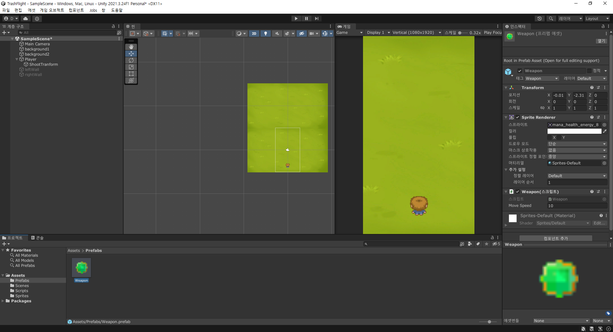
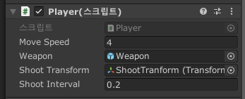

# 1. 마우스로 움직이기

```c#
// 마우스로 제어
// Debug.Log(Input.mousePosition); // console view에서 확인가능
Vector3 mousePos = Camera.main.ScreenToWorldPoint(Input.mousePosition);
Debug.Log(mousePos);
```

- 해상도의 마우스 위치와, 벡터를 이용하여 편집기에서 나타난 마우스의 위치는 상이하다.
- 조작하기 편하도록 벡터를 이용하도록 한다.

```C#
Vector3 mousePos = Camera.main.ScreenToWorldPoint(Input.mousePosition);
// Mathf.Clapm로 min, max값을 지정하여 캐릭터가 화면 밖으로 나가지 못하게 한다.
float toX = Mathf.Clamp(mousePos.x, -2.4f, 2.4f);
transform.position = new Vector3(toX, transform.position.y, transform.position.z);
```

# 2. 미사일 만들기



- prefabs에 넣어두면 하나의 오브젝트를 여러번 반복해서 넣는 방법과 같이 쓸 수 있다.
- player 객체에 shoottransform을 자식으로 넣어 미사일이 나갈 위치를 지정해둔다.

```c#
public class Player : MonoBehaviour
{
    ...
    // GameObject를 만들어서 unity 내에서 미사일을 선택할 수 있게 된다.
    [SerializeField]
    private GameObject weapon;

    // player가 공격하는 위치를 지정해준다.
    [SerializeField]
    private Transform shootTransform;

    // 미사일 발사 간격을 지정한다.
    [SerializeField]
    private float shootInterval = 0.05f;
    private float lastshoottime = 0f;

    // Update is called once per frame
    void Update()
    {
        ...

        Shoot(); // update 메서드에서 공격을 반복적으로 실행한다.
    }

    void Shoot(){
        // 이때, 그냥 실행하면 매우 빠르게 공격하기 때문에
        // 아래와 같이 시간을 측정하여 특정 간격만큼만 공격하도록 한다.
        if(Time.time - lastshoottime > shootInterval){
            // Quaternion.identity => rotate 관련 클래스로 회전하지 않음을 의미
            Instantiate(weapon, shootTransform.position, Quaternion.identity);
            lastshoottime = Time.time;
        }
    }
}

public class Weapon : MonoBehaviour
{
    [SerializeField]
    private float moveSpeed = 10;

    // Start is called before the first frame update
    void Start()
    {
        // start 메서드는 오브젝트가 생성될때,
        // 또는 오브젝트가 비활성화에서 다시 활성화될때 실행되는 메서드이다.

        // DEstory는 해당 오브젝트가 특정 시간이 지난후에 제거되도록 할 수 있다.
        Destroy(gameObject, 2);
    }
    ...
}
```



- unity 내에서 serialize를 하여 각각 지정해주면 된다.