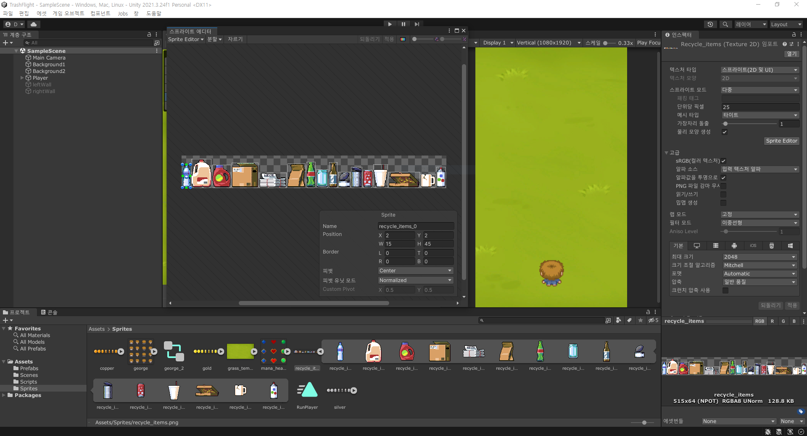
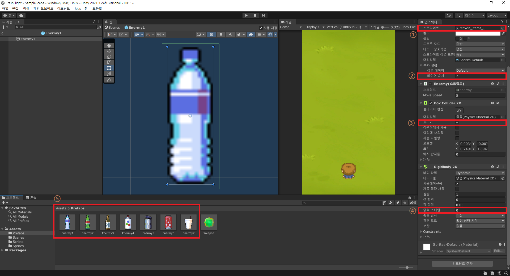
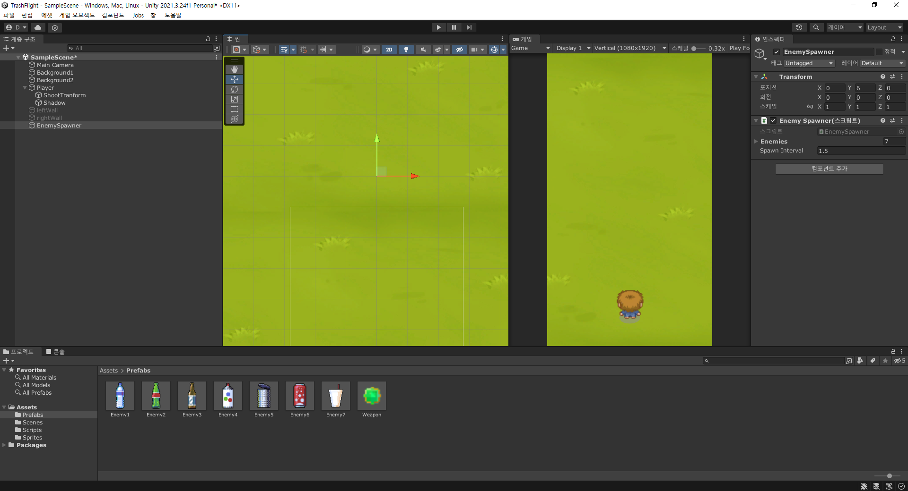
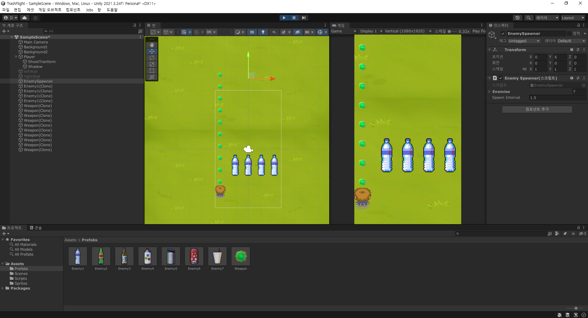
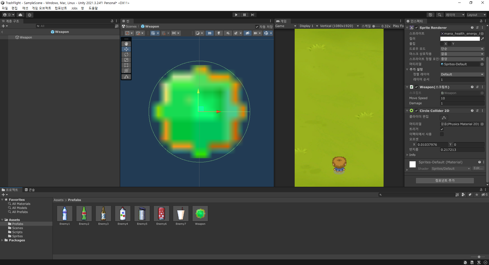

# 1. 적 만들기



- 가져온 스프라이트를 분할하여 적용한다.



1. 이전에 분할한 스프라이트들을 여러개의 오브젝트를 지정하여 5번처럼 나눈다.
2. 배경화면이나 다른 것보다 앞으로 나오게 하기 위해 레이어 순서를 상위로 올린다.
3. 트리거를 선택하면 충돌판정을 가해도 충돌하지 않고, 감지하는 이벤트를 지정할 수 있다.
4. 해당 프로젝트는 중력 스케일을 0으로 두어 아래로 가속하지 않게 한다.
5. 하나의 오브젝트씩 나오는게 아닌, 중복되서 나오므로 이전에 미사일처럼 prefabs로 넣어준다.

- 이후, box collider 를 지정하여 collider editor를 사용하여 각각의 프리팹의 충돌판정크기를 지정한다.
- 위의 사진에서 각 프리팹의 초록색 선이 충돌판정선이라 보면 된다.

```csharp
public class enermy : MonoBehaviour
{
    [SerializeField]
    private float moveSpeed = 10f; // 움직이는 속도
    private float minY = -7f; // 사라지는 위치 지정
    // Update is called once per frame
    void Update()
    {
        // 한 프레임당 실행할 함수이다.
        transform.position += Vector3.down * moveSpeed * Time.deltaTime;
        if(transform.position.y < minY) {
            Destroy(gameObject); // 이 함수로 해당 오브젝트를 제거한다.
        }
    }
}
```

# 2. 적을 랜덤으로 스폰하게 하기.

- 랜덤으로 적을 스폰하게 하려면 먼저 어느 위치에서, 어떤 적들을 스폰할 것인지 정해주어야 한다.

```csharp
public class EnemySpawner : MonoBehaviour
{
    [SerializeField]
    // 현재 SerializerField에 저장한 objects를 불러온다.
    private GameObject[] enemies;
    // 적들이 나타난 x좌표를 기록한다.
    private float[] SpawnPositionX = {-2.22f, -1.11f, 0f, 1.11f, 2.22f};

    [SerializeField]
    private float SpawnInterval = 1.5f;

    // Start is called before the first frame update
    void Start()
    {
        StartEnemyRoutine();
    }

    // 이 루틴을 정해줌으로써 다른 코드를 실행하느라 새롭게 실행하지 못하는 것을
    // 아래의 코드로 인해 실핼할 수 있게 해준다.
    void StartEnemyRoutine() {
        StartCoroutine("EnemyRoutine");
    }

    IEnumerator EnemyRoutine() {
        // 3초가 지난 후에 아래의 무한 반복문을 실행한다.
        yield return new WaitForSeconds(3f);

        int Enemyidx = 0, spawnCnt = 0;
        float moveSpeed = 5f;

        while(true){
            for (int idx = 0; idx < 5; idx++)
            {
                // 모든 좌표에서 랜덤 적의 모습으로 적들을 생성한다.
                // Enemyidx = Random.Range(0, enemies.Length);
                SpawnEnemy(SpawnPositionX[idx], Enemyidx, moveSpeed);
            }

            // 10번 스폰될 때마다 적들의 레벨을 증가시킨다.
            // 이동속도도 동일하게 늘어난다.
            if(++spawnCnt == 10){
                spawnCnt = 0;
                Enemyidx++;
                moveSpeed++;
            }

            // 위에서 정의된 시간 간격마다 이 반복문이 실행된다.
            yield return new WaitForSeconds(SpawnInterval);
        }
    }

    // posX : x좌표, idx : 랜덤으로 정한 적의 번호
    void SpawnEnemy(float posX, int idx, float moveSpeed)
    {
        // 해당 좌표에 맞게 적들을 생성한다.
        Vector3 spawnPos = new Vector3(posX, transform.position.y, 0);

        // 20% 확률로 더 강한 적이 나타나도록 한다.
        if(Random.Range(0, 5) == 0){
            idx++;
        }

        // 계속 적의 레벨이 증가하다가 마지막 적의 레벨까지 나타났을 때 오류를 방지한다.
        if(idx >= enemies.Length) {
            idx = enemies.Length - 1;
        }

        // 새로운 게임 오브젝트를 생성한다.
        // 객체, 위치, 회전
        // Quaternion.identity : 기본 회전값.
        GameObject enemyObj = Instantiate(enemies[idx], spawnPos, Quaternion.identity);

        // class의 컴포넌트를 가져온다.
        // 해당 컴포넌트의 메서드를 사용할 수 있게 된다.
        // 여기서는 하단의 코드블럭의 메서드를 가져온다.
        Enemy enemy = enemyObj.GetComponent<Enemy>();
        enemy.SetMoveSpeed(moveSpeed);
    }
}
```
```Csharp
public class Enemy : MonoBehaviour
{
    [SerializeField]
    private float moveSpeed = 10f;
    ...

    // 다른 클래스에서 적의 이동속도를 제어할 수 있게 해준다.
    public void SetMoveSpeed(float moveSpeed) {
        this.moveSpeed = moveSpeed;
    }

    ...
}
```

- 이처럼 코드를 작성한 후에, unity 화면에서 EnemySpawner object를 만들어준다.



- 해당 위치에서 위의 코드에 작성된 X좌표에 따라 적들이 나타난다.



# 3. 충돌 처리

- 적과 미사일이 충돌하는 판정을 가지려면 unity에서 제공하는 메서드를 만들어야 한다.

```Csharp
public class Enemy : MonoBehaviour
{
    [SerializeField]
    private float moveSpeed = 10f;
    private float minY = -7f;
    [SerializeField]
    private float Hp = 1f; // 적들의 체력을 각자 따로 설정할 수 있게 한다.

    // 다른 클래스에서 적의 이동속도를 제어할 수 있게 해준다.
    public void SetMoveSpeed(float moveSpeed) {
        this.moveSpeed = moveSpeed;
    }

    // Update is called once per frame
    void Update()
    {
        transform.position += Vector3.down * moveSpeed * Time.deltaTime;
        if(transform.position.y < minY) {
            Destroy(gameObject); // 이 함수로 해당 오브젝트를 제거한다.
        }
    }

    // isTrigger가 체크되어 있는 경우에 쓸 수 있는 unity에서 제공하는 메서드이다.
    private void OnTriggerEnter2D(Collider2D other) {
        // other에서 gameobject를 찾아 tag로 지정해준 값을 찾으면 된다.
        if(other.gameObject.tag == "Weapon") {
            Weapon weapon = other.gameObject.GetComponent<Weapon>();
            Hp -= weapon.Damage;
            if(Hp <= 0) {
                Destroy(gameObject);
            }
            // 미사일은 닿자마자 바로 소멸해야 하므로 제거해준다.
            Destroy(other.gameObject);
        }
    }

    // [참고] 물리적인 충돌처리를 감지한 경우에 쓸 수 있는 unity에서 제공하는 메서드이다.
    private void OnCollisionEnter2D(Collision2D other) {
        
    }
}
```

- 이때, 미사일에도 충돌 컴포넌트를 넣어야 적과 충돌 이벤트를 만들 수 있다.
- [주의!]
  - 만약 미사일에 충돌 컴포넌트를 넣었을 때 플레이어 캐릭터가 조금씩 뒤로 밀리는 현상이 생긴다면 아래처럼 트리거(isTrigger)를 체크해주어야 한다.
  - 이 오류는 미사일이 생성되자마자 플레이어와 충돌판정이 일어나 캐릭터가 밀리는 현상이다.
  

- 플레이어 캐릭터 스크립트에서도 충돌 트리거 이벤트를 넣어 적과 부딪히면 플레이어를 제거하도록 만들어준다.

```Csharp
private void OnTriggerEnter2D(Collider2D other) {
    if(other.gameObject.tag == "Enemy") {
        Destroy(gameObject);
    }
}
```