# 1. 코인 만들기

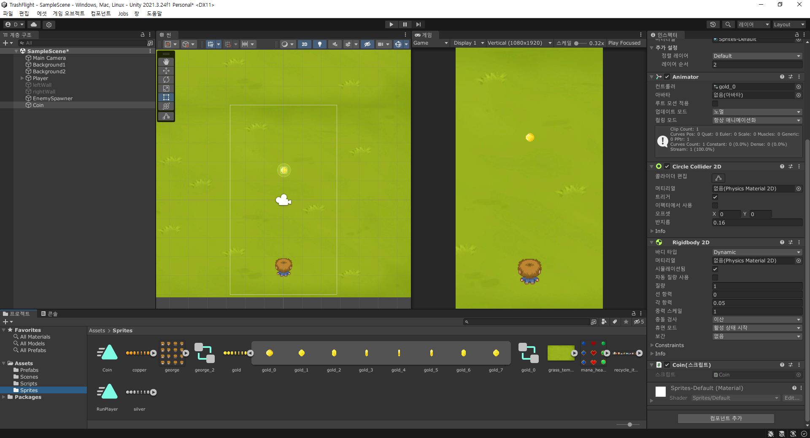

- 이제까지 했던 것을 토대로 스프라이트 설정과 애니메이션, 그리고 인스펙터를 넣어준다.
- 이때, 코인이 나오면 위로 점프했다가 내려가는 형태로 만들기 위해 RigidBody 2D의 중력상수를 1로 만들어준다.

```c#
public class Coin : MonoBehaviour
{
    void Start()
    {
        Jump();
    }

    void Jump() {
        // Rigidbody의 컴포넌트를 가져온다.
        Rigidbody2D rigidBody = GetComponent<Rigidbody2D>();

        // 코인이 튀는 것을 랜덤으로 설정
        float randomJumpForce = Random.Range(4f, 8f);
        Vector2 jumpVelocity = Vector2.up * randomJumpForce;

        // rigidbody의 힘을 가한다.
        // impulse는 기본 단위의 힘벡터를 말한다.
        rigidBody.AddForce(jumpVelocity, ForceMode2D.Impulse);
    }

    void Update()
    {
        // 화면 밖으로 벗어난(아래쪽) 코인 제거
        if(transform.position.y < minY) {
            Destroy(gameObject); // 이 함수로 해당 오브젝트를 제거한다.
        }
    }
}
```
```c#
// in Enemy.cs

// 미리 코인의 오브젝트를 설정해둔다.
[SerializeField]
private GameObject Coin;

// in OnTriggerEnter2D
// 적이 사망할 때 코인을 생성하게 한다.
if(Hp <= 0) {
    Destroy(gameObject);
    Instantiate(Coin, transform.position, Quaternion.identity);
}
```

# 2. 점수 출력판 만들기

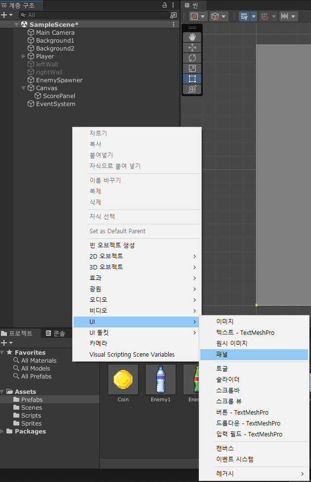

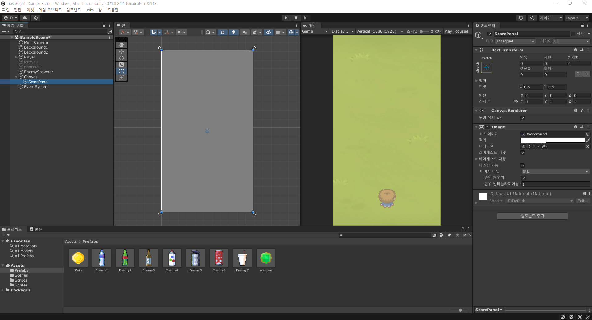

- 위와 같이 새로운 캔버스를 만들어 주면 굉장히 큰 화면에서 나타나게 된다. 물론 실제로 큰 것은 아니고, 작업하기 편하도록 크게 만들어 둔것.
- 점수출력판을 만들기 위해서 아래와 같이 만들어진 panel을 선택하고 인스펙터에서 Reac transform의 앵커 프리셋을 눌러 화면 왼쪽 상단에 보이도록 만들어준다.

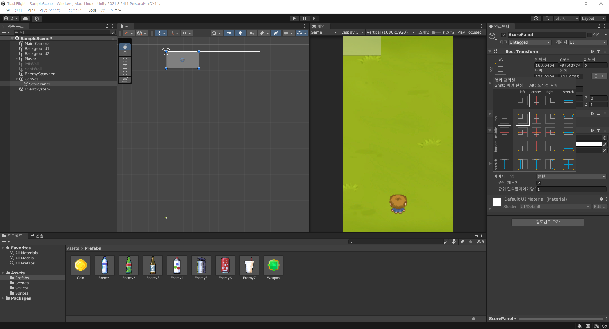

- 이때 앵커 프리셋을 누를 떄 Alt키를 누른 채로 해야 한다.
- 동시에 scene에서 보여지는 패널도 크기를 왼쪽 상단으로 맞춰준다.
---
## 1) image input

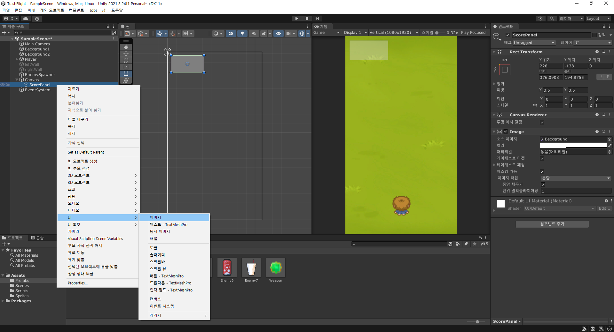

- 코인을 먹은 수를 보여주기 위해 image UI를 넣어준다.
- 위의 사진처럼 image판을 만들어준다.

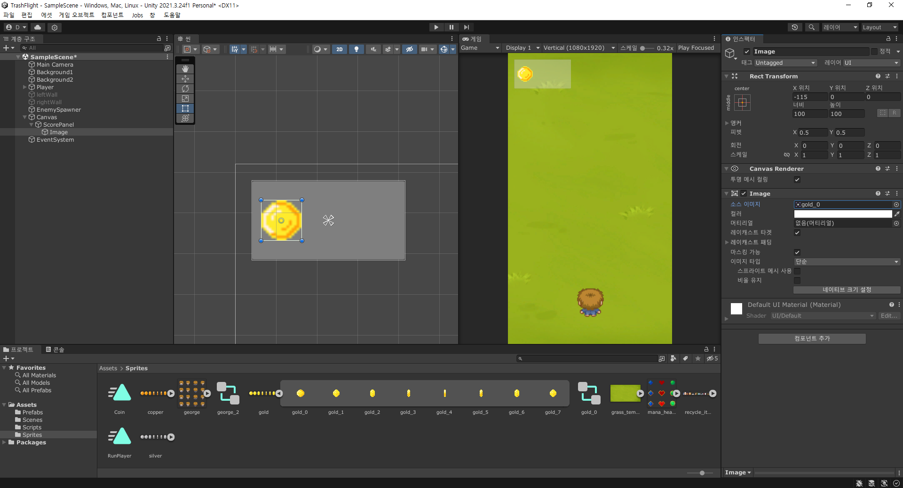

- 위치 조정을 해주고 이미지 소스를 sprites의 코인을 선택하면 위와 같이 바뀌게 된다.

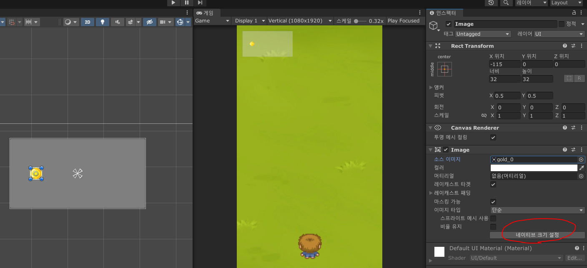

- 네이티브 사이즈를 클릭하면 패널에 맞게 사이즈가 조정된다.
- Alt를 누른채로 비율을 유지한 상태에서 사이즈를 조절해준다.
---
## 2) text input

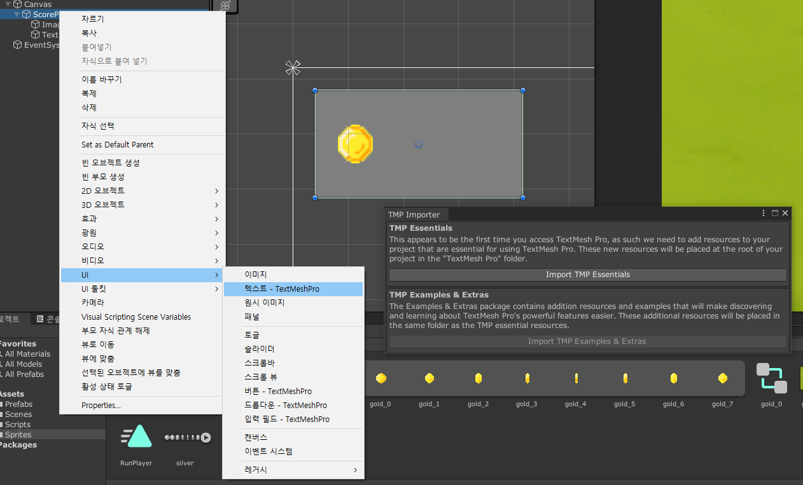

- 패널 우클릭 > UI > textmesh를 클릭하고 뜨는 창에서 import를 해준다.

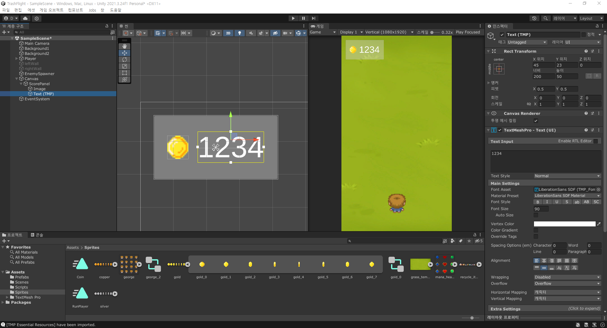

- textinput이 해당 칸에 들어갈 문자열이다.
- Font size를 적당히 조절하여 가시성 있는 문자열로 만들어준다.
- Alignment를 사용하여 정렬, 아래의 wrapping을 해제하면 숫자가 자동줄바꿈이 되지 않게된다.

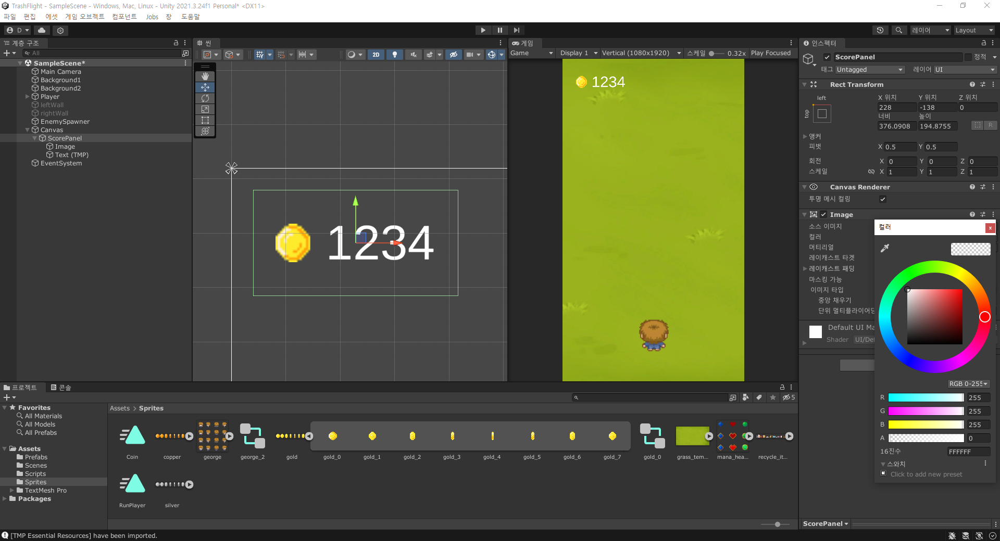

- 마지막으로 패널의 투명도를 없애서 이미지와 텍스트만 보이게 해준다.

---

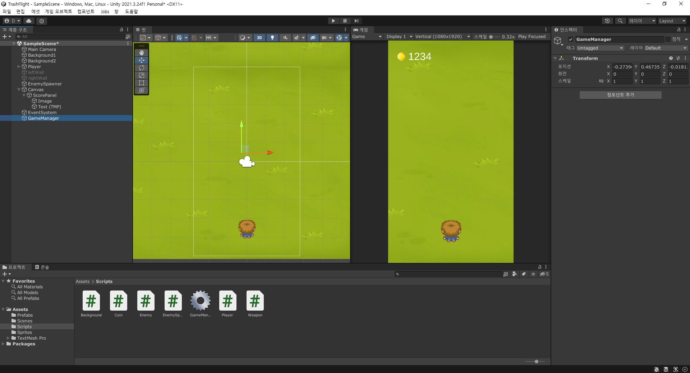

- 코인을 먹으면 숫자가 올라가는 게임오브젝트와 스크립트를 만들어준다.
- GameManager라고 이름을 붙이면 해당 스크립트는 특별하게 아이콘이 톱니바퀴로 변한다.
  - 특별한 의미는 없다. 기능은 같지만 좀 더 무엇인지 확인하기 편하다.
  - GameManager Hierarchy를 선택하고 GameManager에 아래와 같이 만든 코드의 text에 TextMesh를 넣어준다.

- 해당 코드는 싱글톤이라는 디자인 패턴을 사용한 것으로, 아래의 3번에 설명하도록 하겠다.

```c#
using TMPro;

public class GameManager : MonoBehaviour
{
    private static GameManager instance = null;

    [SerializeField]
    private TextMeshProUGUI text;// 이 클래스를 쓰기 위해 상단에 TMPro를 사용한다.
    // 위처럼 만든뒤에 unity에서 textMesh를 넣어준다.

    private int coin = 0;

    ...

    public void IncreaseCoin() {
        coin += 1;
        // setText는 문자열을 바꿔주는 메서드.
        // 여기서 coin은 int형이므로, toString 메서드를 이용하여 문자열로 바꿔준다.
        text.SetText(coin.ToString());
    }
}
```

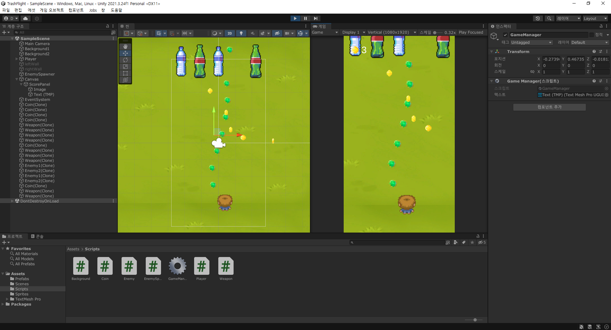

- 코인이 잘 먹어지고 있는 것을 확인할 수 있다.

# 3. 유니티 디자인 패턴 - 싱글톤(singleton)

- 유니티에도 다양한 디자인 패턴이 존재한다.
- 여기서는 작은 프로젝트 단위이므로 싱글톤 디자인패턴을 사용해보았다.

```c#
// in GameManager
public class GameManager : MonoBehaviour
{
    /*
        유니티 디자인 패턴 싱글톤을 만들어준다.

        클래스 구조를 짜다보면 다른 클래스의 함수를 사용해야 할 수도 있고, 전체 클래스들이 공유하는 전역변수가 필요할 수도 있다.
        클래스 구조에서 공통적으로 사용하는 전역변수나 리소스, 데이터, 게임 전체를 관장하는 매니저 클래스들을 싱글톤으로 따로 이용하여
        어떤 임의의 클래스에서도 싱글톤 인스탄스를 사용할 수 있게 된다.

        유니티에서 싱글톤을 사용하는 방법은 2가지가 있는데,
        1) 싱글톤 클래스가 어느 유니티 c# 스크립트처럼 MonoBehaviour를 상속받아서 Hierarchy에 존재하게 하는 것
        2) MonoBehaviour를 상속받지 않고 Hierarchy에 존재하지 않게 하는 것.
    */

    // 정적 전역변수인 게임매니저를 만들어준다.
    // 보안을 위해 private로 한다.
    private static GameManager instance = null;

    // start 메서드보다 더 먼저 실행되는 메서드
    void Awake() {
        if(instance == null){
            // 이 클래스 인스탄스가 만들어졌을 때 게임매니저 인스턴스가 없다면 넣어준다.
            instance = this;

            // 씬 전환이 되더라도 파괴되지 않게 한다.
            DontDestroyOnLoad(this.gameObject);
        }
        else{
            // 씬 이동을 하였는데 그 씬에도 Hierarchy에 GameManager가 있을 수도 있다.
            // 그럴 경우 이전 씬에서 사용한 인스턴스는 제거해준다.
            Destroy(this.gameObject);
        }
    }

    // 게임매니저 인스턴스에 접근할 수 있는 프로퍼티. static으로 설정되어 다른 클래스에서 호출가능.
    public static GameManager Instance
    {
        get
        {
            if(instance == null){
                return null;
            }
            return instance;
        }
    }

    /*
        만약 2번 방법으로 만든다면 아래와 같이 만들 수 있다.
        
        // 게임 매니저 인스턴스에 접근할 수 있게 해준다.
        public static GameManager Instance
        {
            get
            {
                if(null == instance) {
                    // 게임 인스턴스가 없다면 하나 생성해서 넣어준다.
                    instance = new GamgeManager();
                }
                return instance;
            }
        }

        // 생성자를 하나 만들어줘서 원하는 세팅을 해주면 좋다.
        pubilc GameManager()
        {

        }
    */

    public void IncreaseCoin() {

    }
}

```

- 이 외에도 여러가지 디자인 패턴들이 존재한다.
- [싱글톤 디자인패턴 티스토리글](https://glikmakesworld.tistory.com/2)

# 4. 무기 업그레이드

- 먼저 아래와 같이 사용할 무기들을 만들어준다.

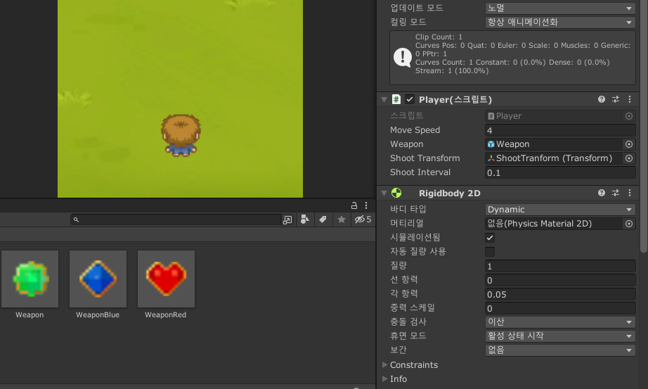

- 현재 플레이어 스크립트에 적용된 serializerField에는 하나의 무기만 적용되어 있는데, 이를 바꾸어준다.

```c#
public class Player : MonoBehaviour
{
    ...
    // GameObject를 만들어서 unity 내에서 미사일을 선택할 수 있게 된다.
    [SerializeField]
    private GameObject[] weapons; // 하나의 클래스값을 배열로 만들어준다.
    private int weaponidx = 0; // 무기 선택용 변수

    ...

    void Shoot(){
        if(Time.time - lastshoottime > shootInterval){
            // weaponidx에 따라 다른 무기를 생성한다.
            Instantiate(weapons[weaponidx], shootTransform.position, Quaternion.identity);
            lastshoottime = Time.time;
        }
    }

    ...

    public void Upgrade() {
        // 길이가 넘어가지 않도록 만들어준다.
        weaponidx += 1;
        if(weaponidx >= weapons.Length) {
            weaponidx = weapons.Length - 1;
        }
    }
}
```
```c#
public class GameManager : MonoBehaviour
{
    ...
    public void IncreaseCoin() {
        coin += 1;
        text.SetText(coin.ToString());

        // 30개 단위로 먹을 때 마다 무기가 업그레이드 된다.
        if(coin % 30 == 0){ // 30, 60, 90 ...
            // player 클래스의 메서드를 불러오기 위해 아래와 같이 입력한다.
            // GetComponent를 쓰지 않는 이유? => 현재 게임매니저 메서드에 전달받은 값이 없다. 그래서 해당 오브젝트를 찾을 수가 없음.
            // 그래서 게임 내에서 오브젝트를 찾아서 가져온다.
            Player player = FindObjectOfType<Player>();
            if(player != null) {
                player.Upgrade();
            }
        }
    }
}
```

# 5. 게임 오버 처리하기

- 적 생성을 멈추고, 팝업창을 띄우는 과정을 만든다.

```c#
public class GameManager : MonoBehaviour
{
    ...

    // 인스펙터에서 확인할 수 없게 한다.
    [HideInInspector]
    public bool isGameOver = false;

    ...

    public void SetGameOver() {
        // 이 함수가 실행되면 변수값을 바꿔준다.
        isGameOver = true;
        
        EnemySpawner enemySpawner = FindAnyObjectByType<EnemySpawner>();
        if(enemySpawner != null) {
            enemySpawner.StopEnemyRoutine();
        }
    }
}
```
```c#
public class Player : MonoBehaviour
{
    ...
    void Update()
    {
        ...

        // 해당 변수값이 true가 되면 게임이 종료되어 플레이어가 더이상
        // 공격을 하지 않게 한다.
        if(GameManager.Instance.isGameOver == false){
            Shoot();
        }
    }
    ...
}
```
```c#
// in Emeny.cs
private void OnTriggerEnter2D(Collider2D other) {

    if(other.gameObject.tag == "Weapon") {
        ...
        if(Hp <= 0) {
            Destroy(gameObject);
            // 해당 유닛을 제거하면서 만약 보스였다면 게임오버 메서드를 실행한다.
            if(gameObject.tag == "EnemyBoss"){
                GameManager.Instance.SetGameOver();
            }
            else{
                Instantiate(Coin, transform.position, Quaternion.identity);
            }
        }
        ...
    }
}

// in Player.cs
private void OnTriggerEnter2D(Collider2D other) {
    // 적에게 닿았을 경우에도 게임오버를 만든다.
    if(other.gameObject.tag == "Enemy" || other.gameObject.tag == "EnemyBoss") {
        Destroy(gameObject);
        GameManager.Instance.SetGameOver();
    }
    ...
}
```

- 이제 게임오버시 나타날 패널을 정의해주면 된다.

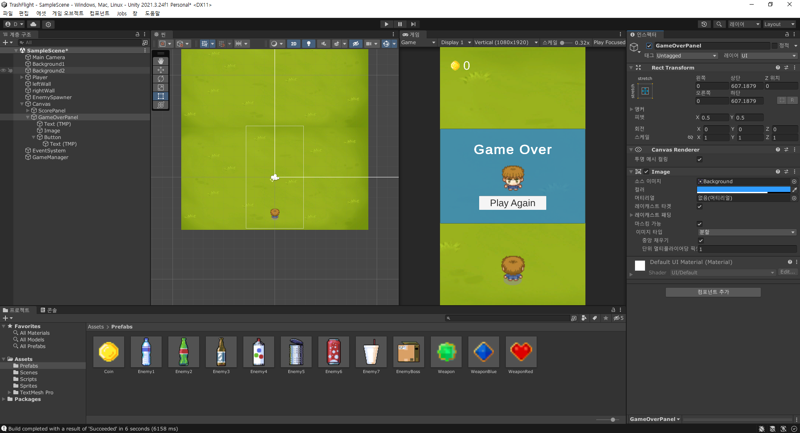

```c#
...
// SceneManagement를 불러와서 해당 씬을 재사용할 수 있게 한다.
using UnityEngine.SceneManagement;

public class GameManager : MonoBehaviour
{
    ...

    // 게임오버시 패널설정
    [SerializeField]
    private GameObject gameOverPanel;

    // 재시작버튼 오브젝트
    [SerializeField]
    private GameObject gameAgainButton;

    ...

    public void SetGameOver() {
        isGameOver = true;
        
        EnemySpawner enemySpawner = FindAnyObjectByType<EnemySpawner>();
        if(enemySpawner != null) {
            enemySpawner.StopEnemyRoutine();
        }
        // 특정 메서드를 일정 시간이 지난 뒤에 호출한다.
        Invoke("ShowGameOverPanel", 1f);
    }

    void ShowGameOverPanel() {
        // 비활성화중인 패널을 활성화시킨다.
        gameOverPanel.SetActive(true);
    }

    public void PlayAgain() {
        // import한 SceneManager에서 Scene을 불러온다.
        SceneManager.LoadScene("SampleScene");
    }
}
```

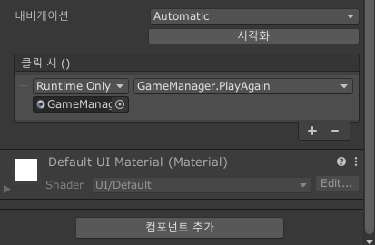

- button의 onclick()을 게임매니저 오브젝트의 메서드인 playAgain를 넣어주면 해당 버튼을 누를 때 메서드가 호출된다.